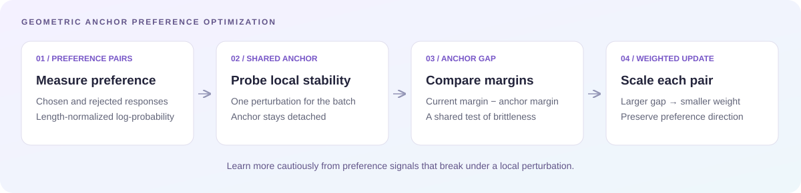

<div align="center">

# GAPO

### Learning Where It Matters: Geometric Anchoring for Robust Preference Alignment

**Youngjae Cho · Jongsuk Kim · Ji-Hoon Kim**

[](#news)
[](https://arxiv.org/abs/2602.04909)
[](LICENSE)

[Paper](https://arxiv.org/abs/2602.04909) · [Results](#results) · [Quick start](#quick-start) · [Citation](#citation)

</div>

**Geometric Anchor Preference Optimization (GAPO)** uses a local stability probe to decide how strongly each preference pair should influence learning. Pairs whose preference margins degrade more under a shared perturbation receive smaller update weights.

## News

- **Accepted to NeurIPS 2026!**
- The [paper](https://arxiv.org/abs/2602.04909) describes the method, theoretical analysis, and experiments.

## Method



The paper defines a length-normalized preference margin for each chosen/rejected pair. A shared perturbation decreases the batch-average margin, producing a detached geometric anchor. The **Anchor Gap** compares each pair's current margin with its anchor margin:

$$
\Gamma_i = M_i(\theta) - \mathrm{sg}(M_i(\tilde{\theta})).
$$

$$
\mathcal{L}_{\mathrm{GAPO}} = -\frac{1}{N}\sum_i \log \sigma(\beta\Gamma_i-\gamma).
$$

Here, $\mathrm{sg}$ denotes stop-gradient. The resulting per-pair gradient weight is $w_i=\beta\sigma(\gamma-\beta\Gamma_i)$: larger gaps receive smaller weights. See [Section 4](https://arxiv.org/html/2602.04909v3#S4) for the formulation.

## Results

Instruction-following results reported in [Table 1 of the paper (arXiv v3)](https://arxiv.org/html/2602.04909v3#S6.T1). All scores are percentages; higher is better. **LC** is length-controlled win rate and **WR** is win rate. These are paper results, not a new benchmark run of this checkout.

| GAPO backbone | AlpacaEval 2 LC ↑ | AlpacaEval 2 WR ↑ | Arena-Hard WR ↑ |
| :--- | ---: | ---: | ---: |
| Mistral-Instruct · 7B | **35.7** | **38.7** | **22.7** |
| Llama-3-Base · 8B | **25.0** | **23.7** | **30.3** |
| Llama-3-Instruct · 8B | **47.4** | **42.8** | **33.7** |
| Gemma-2-Instruct · 9B | **74.0** | **67.7** | **61.5** |

<details>
<summary><strong>Full comparison with baselines</strong></summary>

**Mistral-Instruct (7B) and Llama-3-Base (8B)**

| Method | Mistral AE2 LC | Mistral AE2 WR | Mistral Arena | Llama-Base AE2 LC | Llama-Base AE2 WR | Llama-Base Arena |
| :--- | ---: | ---: | ---: | ---: | ---: | ---: |
| SFT | 17.1 | 14.7 | 12.6 | 6.2 | 4.6 | 3.3 |
| DPO | 26.8 | 24.9 | 16.3 | 18.2 | 15.5 | 15.9 |
| IPO | 20.3 | 20.3 | 16.2 | 14.4 | 14.2 | 17.8 |
| CPO | 23.8 | 28.8 | 22.6 | 10.8 | 8.1 | 5.8 |
| KTO | 24.5 | 23.6 | 17.9 | 14.2 | 12.4 | 12.5 |
| ORPO | 24.5 | 24.9 | 20.8 | 12.2 | 10.6 | 10.8 |
| R-DPO | 27.3 | 24.5 | 16.1 | 17.6 | 14.4 | 17.2 |
| SimPO | 32.1 | 34.8 | 21.0 | 22.0 | 20.3 | 23.4 |
| α-DPO | 32.3 | 32.6 | 21.7 | 18.3 | 13.8 | 22.5 |
| **GAPO** | **35.7** | **38.7** | **22.7** | **25.0** | **23.7** | **30.3** |

**Llama-3-Instruct (8B) and Gemma-2-Instruct (9B)**

| Method | Llama-Inst AE2 LC | Llama-Inst AE2 WR | Llama-Inst Arena | Gemma AE2 LC | Gemma AE2 WR | Gemma Arena |
| :--- | ---: | ---: | ---: | ---: | ---: | ---: |
| SFT | 26.0 | 25.3 | 22.3 | 48.7 | 36.5 | 42.1 |
| DPO | 40.3 | 37.9 | 32.6 | 70.4 | 66.9 | 58.8 |
| IPO | 35.6 | 35.6 | 30.5 | 62.6 | 58.4 | 53.5 |
| CPO | 28.9 | 32.2 | 28.8 | 56.4 | 53.4 | 55.2 |
| KTO | 33.1 | 31.8 | 26.4 | 61.7 | 55.5 | 53.8 |
| ORPO | 28.5 | 27.4 | 25.8 | 56.2 | 46.7 | 46.2 |
| R-DPO | 41.1 | 37.8 | 33.1 | 68.3 | 66.9 | 57.9 |
| SimPO | 44.7 | 40.5 | **33.8** | 72.4 | 65.0 | 57.8 |
| α-DPO | 46.6 | 38.1 | 33.3 | 73.4 | 66.1 | 60.8 |
| **GAPO** | **47.4** | **42.8** | 33.7 | **74.0** | **67.7** | **61.5** |

AE2 = AlpacaEval 2; Arena = Arena-Hard WR. Bold marks the best score in each column.

</details>

## Quick start

### 1. Set up the environment

Use Linux, Python 3.10, and NVIDIA GPUs with a compatible CUDA installation. Full-parameter training of the supplied 7B–9B models requires substantial GPU memory; choose the GPU count and batch size for your hardware.

```bash
git clone https://github.com/youngjae-cho/GAPO.git
cd GAPO

python3.10 -m venv .venv
source .venv/bin/activate
python -m pip install --upgrade pip setuptools wheel

# CUDA 12.8 build; choose a compatible PyTorch build for your system.
python -m pip install torch==2.7.1 --index-url https://download.pytorch.org/whl/cu128
python -m pip install -r requirements.txt

# Required by recipes that select flash_attention_2.
MAX_JOBS=4 python -m pip install flash-attn==2.7.4.post1 --no-build-isolation
```

The dependency pins capture the local development environment. For gated Hugging Face models, accept the model's access terms and authenticate with `hf auth login` before training.

### 2. Train Mistral-Instruct

Run from the repository root. The entry point loads the model, downloads the configured preference dataset, formats chosen/rejected pairs, and starts training.

```bash
PYTHONPATH=. accelerate launch \
  --config_file accelerate_configs/deepspeed_zero3.yaml \
  --num_processes 2 \
  scripts/run_gapo.py \
  training_configs/mistral-7b-instruct-gapo.yaml \
  --output_dir=outputs/mistral-7b-instruct-gapo \
  --report_to=none
```

The Mistral recipe uses `mistralai/Mistral-7B-Instruct-v0.2` and `princeton-nlp/mistral-instruct-ultrafeedback`. Checkpoints and the final model are saved under `output_dir`.

Arguments after the YAML file use **`--key=value`** syntax. To adjust memory use, set `--per_device_train_batch_size=...`, `--gradient_accumulation_steps=...`, and `--gradient_checkpointing=true`. The effective optimizer batch size is:

```text
number of GPUs × per-device train batch size × gradient accumulation steps
```

The launch command disables external experiment logging. To use Weights & Biases, run `wandb login` and replace `--report_to=none` with `--report_to=wandb`.

### 3. Choose another backbone

Replace the training YAML and `output_dir` in the command above.

| Backbone | Training configuration |
| :--- | :--- |
| Mistral-Instruct · 7B | [mistral-7b-instruct-gapo.yaml](training_configs/mistral-7b-instruct-gapo.yaml) |
| Llama-3-Base · 8B | [llama-3-8b-base-gapo.yaml](training_configs/llama-3-8b-base-gapo.yaml) |
| Llama-3-Instruct · 8B | [llama-3-8b-instruct-gapo.yaml](training_configs/llama-3-8b-instruct-gapo.yaml) |
| Gemma-2-Instruct · 9B | [gemma-2-9b-it-gapo.yaml](training_configs/gemma-2-9b-it-gapo.yaml) |

Each YAML selects the model, dataset, and training settings. The recipes use full-parameter training by default.

## Repository layout

```text
alignment/           Model, tokenizer, data, and argument utilities
scripts/
  run_gapo.py        Training entry point
  gapo_trainer.py    GAPO trainer
  gapo_config.py     GAPO-specific arguments
training_configs/    Model and dataset recipes
accelerate_configs/  Distributed training configurations
```

## Citation

```bibtex
@article{cho2026gapo,
  title   = {Learning Where It Matters: Geometric Anchoring for Robust Preference Alignment},
  author  = {Cho, Youngjae and Kim, Jongsuk and Kim, Ji-Hoon},
  journal = {arXiv preprint arXiv:2602.04909},
  year    = {2026},
  url     = {https://arxiv.org/abs/2602.04909}
}
```

## Acknowledgments and license

This code builds on [SimPO](https://github.com/princeton-nlp/SimPO), the [Hugging Face Alignment Handbook](https://github.com/huggingface/alignment-handbook), and [TRL](https://github.com/huggingface/trl).

Released under the [Apache License 2.0](LICENSE).
